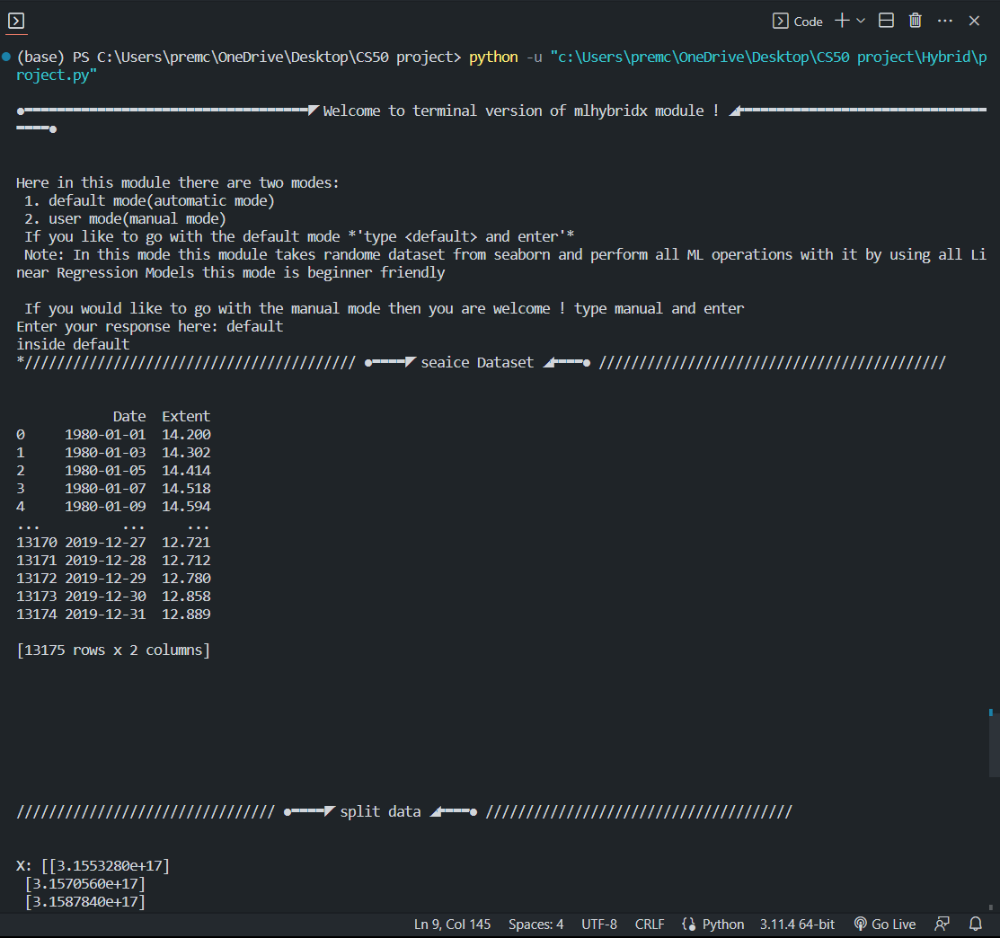
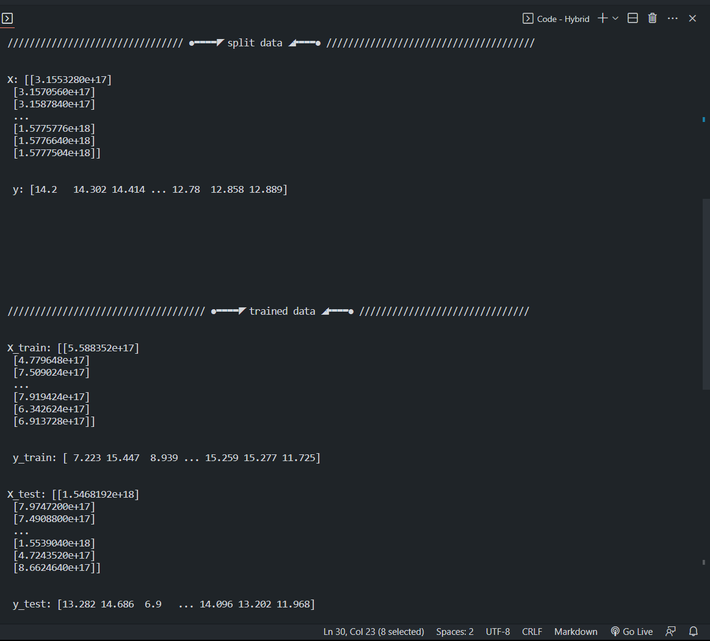
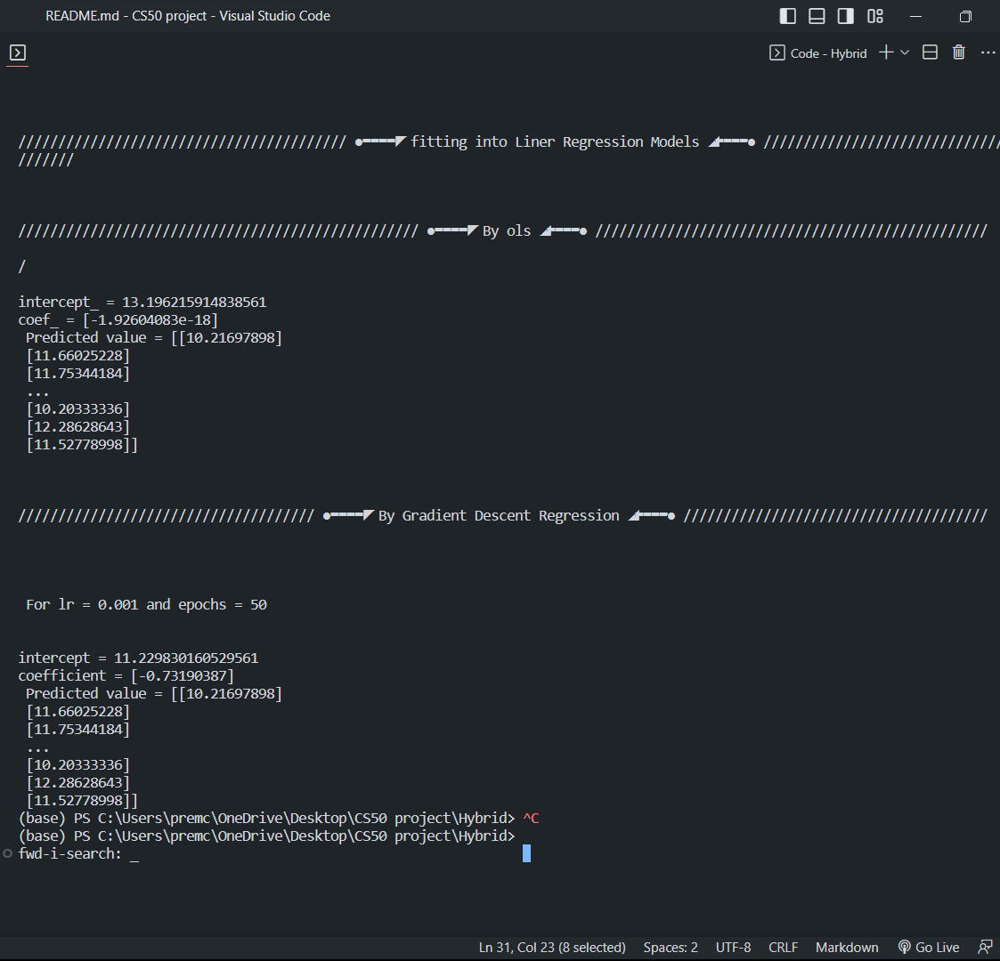
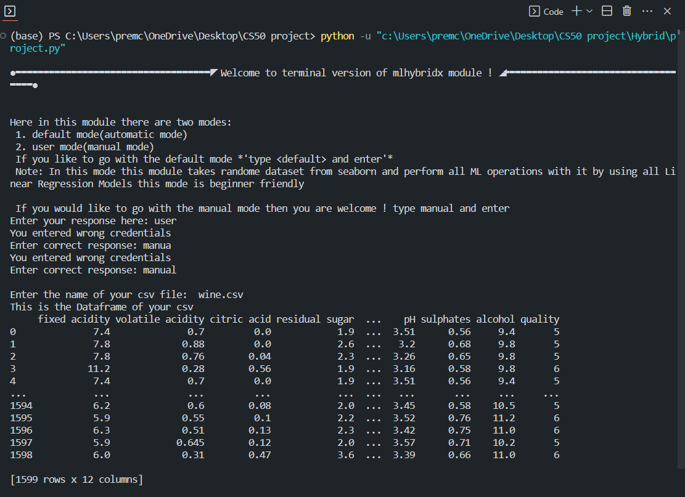
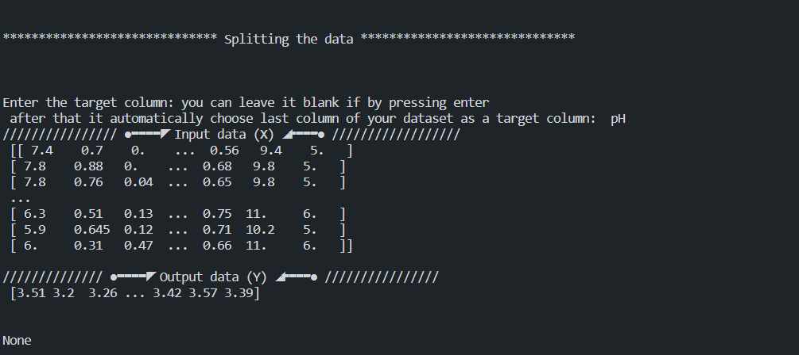
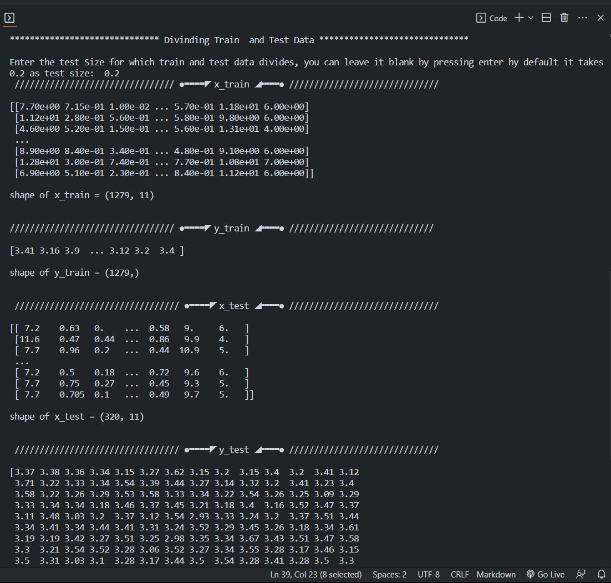
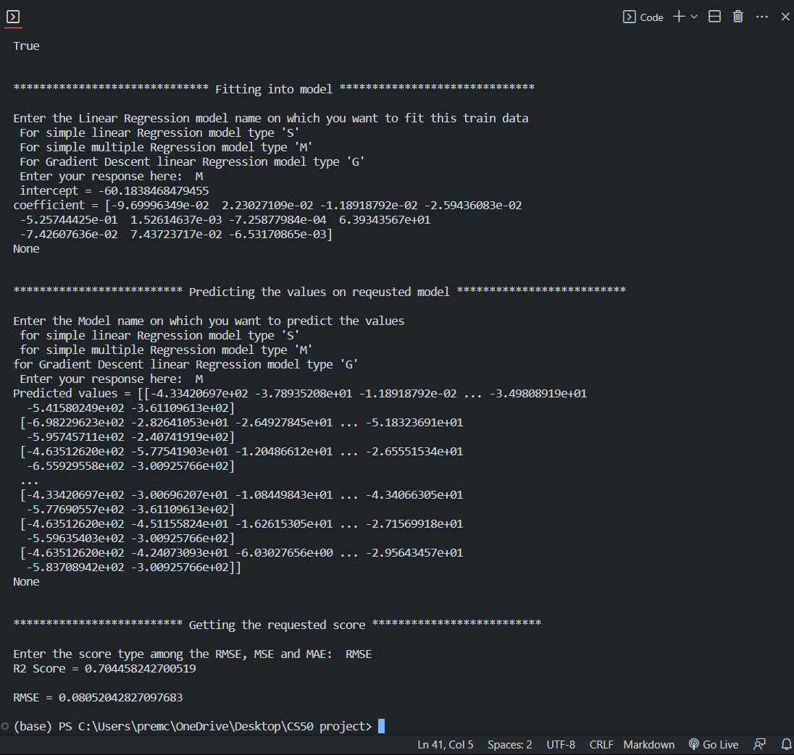

# Project Name : mlhybridx
#### Video Demo:  <URL HERE>
#### Description:
This project focuses on the implementation of fundamental machine learning algorithms from scratch. The primary goal is to gain a deep understanding of how these algorithms work by coding them manually. By implementing algorithms like linear regression and logistic regression, we can explore their inner workings, mathematical foundations, and practical applications.

## TODO 
it uses a linear Regression model machine learning techinques to gave you detailed explain explaination about his model.
It is a basic algorithm for predicting a continuous target variable based on one or more input features. It involves fitting a linear relationship between the inputs and the target variable.

### How to use it?

All you have to do just clone it from git hub repo whose link is shared and voila !!
its ready to use now just run the project.py file which is inside the mlhybridx folder and follow the details as per the instructions.

### Usage
Here in this module there are two modes: 
 1. default mode(automatic mode)
 2. user mode(manual mode)
 If you like to go with the default mode *'type <u>default</u> and enter'* 
 Note: In this mode this module takes randome dataset from seaborn and perform all ML operations with it by using all Linear Regression Models this mode is beginner friendly 

 If you would like to go with the manual mode then you are welcome ! *'type <U>manual</U> and enter'* 

#### Samples of usage
On running on default mode: 

  
  
  

On running on manual(user) mode :

  
  
  
  

## 🔗 Links

Documentation : [
mlhybridx · TestPyPI
](https://test.pypi.org/project/MLHybridX/1.5.0/)

Github Repo(for module version): [mlhybridx Module ](https://github.com/sudheer0071/MLHybridX)

Github Repo(for terminal version): [mlhybridx terminal-version](https://github.com/sudheer0071/mlhybridx-terminal-version/tree/main)

